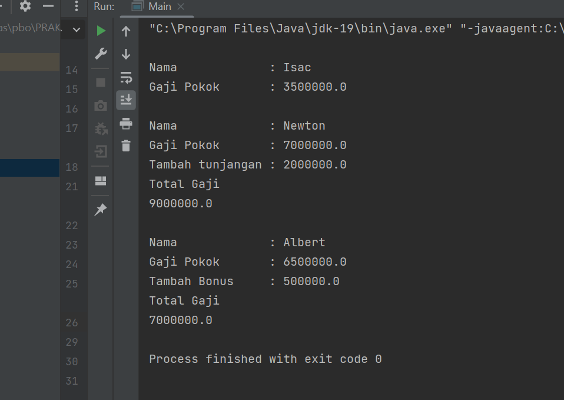

# PRAKTIKUM5
## Pemrograman Orientasi Objek

````shell
Nama   : Ikram Ramadhan
Nim    : 312110478
Matkul : Pemrograman Orientasi Objek
````


### 1. File Pegawai.java
* *CODINGAN FILE 1

```java
package Praktikum5;

public class Pegawai {
  //Atribute
  private String name;
  private double gajipokok;

  // overload Constructor
  public Pegawai (String name,double gajipokok){
    this.name = name;
    this.gajipokok = gajipokok;
  }
  //SETTER
  public void setName(String name) {
    this.name = name;
  }
  //GETTER
  public String getName() {
    return name;
  }

  public void setGajipokok(double gajipokok) {
    this.gajipokok = gajipokok;
  }

  public double getGajipokok() {
    return gajipokok;
  }


  // Overriding Method
  public void display (){
    System.out.println("\nNama \t\t\t : " +getName());
    System.out.println("Gaji Pokok \t\t : " +getGajipokok());
  }
}


```

### 2.Manager.java
* *CODINGAN FILE 2
```java
package Praktikum5;

public class Manager extends Pegawai{
  // Atribut
  private double tunjangan;

  //Overloading constructor inherite superclass
  public Manager (String name , double gajipokok) {
    super(name,gajipokok);
  }

  //SETTER
  public void setTunjangan(double tunjangan) {
    this.tunjangan = tunjangan;
  }

  //GETTER
  public double getTunjangan() {
    return tunjangan;
  }

  //Overiding Method
  @Override
  public void display() {
    super.display();
    System.out.println("Tambah tunjangan : " + this.tunjangan);
    System.out.println("Total Gaji");
    System.out.println(+getGajipokok()+getTunjangan());
  }
}

```
### 3.Progammer.java
* *CODINGAN FILE 3
```java
package Praktikum5;

public class Programmer extends Pegawai{
  //Atribute
  private double bonus;
  // Overloading constructor inherite superclass
  public Programmer(String name, double gajipokok) {
    super(name,gajipokok);
  }
  //SETTER
  public void setBonus(double bonus) {
    this.bonus = bonus;
  }
  //GETTER
  public double getBonus() {
    return bonus;
  }
  //Overriding Method
  @Override
  public void display() {
    super.display();
    System.out.println("Tambah Bonus \t : "+ this.bonus);
    System.out.println("Total Gaji");
    System.out.println(+getGajipokok()+getBonus());
  }
}

```
### 5.Main.java
* *CODINGAN FILE 4
```java
package Praktikum5;

public class Main {

  public static void main(String[] args) {
    Pegawai pegawai = new Pegawai("");
    Manager manager = new Manager();
    Programmer programmer = new Programmer();
    pegawai.setName("Isac");
    manager.setName("Newton");
    programmer.setName("Albert");
    pegawai.setGajipokok(3500000);
    manager.setGajipokok(7000000);
    programmer.setGajipokok(6500000);
    manager.setTunjangan(2000000);
    programmer.setBonus(500000);
    pegawai.display();
    manager.display();
    programmer.display();
  }
}

```
* *Hasil output program:*
  
